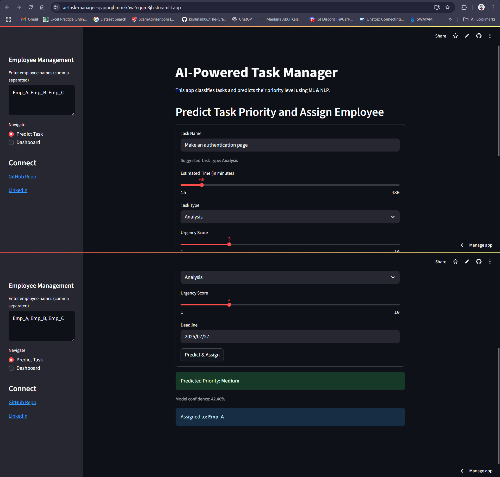

# 🧠 AI-Powered Task Management System  
[](https://www.python.org/)  
[](https://streamlit.io/)  
[](LICENSE)  
[](#)  


An intelligent task manager that leverages **Machine Learning** and **Natural Language Processing (NLP)** to classify tasks and predict their priority level — making task organisation smarter and more efficient.

🔗 **Live App**: [Try the Deployed App on Streamlit 🚀](https://ai-task-manager-qvpipgjbmmzk5w2eqqm8jh.streamlit.app/)  
📂 **Notebook**: [`Project_1_AI_Task_Manager.ipynb`](./AI_Powered_Task_Management_System_(1).ipynb)  
📘 **Training Plan**: Based on a structured 4-week enterprise-level AI project workflow.

---

## 🧩 Problem Statement

> Design and develop an intelligent task management system that can:
> - Automatically classify tasks (e.g., work, personal, urgent)
> - Predict task priority (e.g., High, Medium, Low)
> - Leverage NLP + ML for end-to-end automation
> - Provide visualisation and model evaluation

## 📂 Project Structure

```

ai-task-manager/
│── .devcontainer/             # VSCode + Docker setup (optional)
│── AI_Task_Manager_4Week_Project.ipynb   # Main Jupyter Notebook
│── streamlit_app.py           # Streamlit UI
│── tasks.csv                  # Sample dataset
│── model.pkl                  # Trained ML model
│── vectorizer.pkl             # TF-IDF vectorizer
│── requirements.txt           # Dependencies
│── .gitignore                 # Ignore unnecessary files
│── LICENSE                    # MIT License
│── app_screenshot.png         # App preview image
│── README.md                  # Documentation

```

---
## 🚀 Getting Started

1. **Clone the Repository**
```bash
git clone https://github.com/Tousif18/ai-task-manager.git
cd ai-task-manager
```
2. **Install Dependencies**
```
pip install -r requirements.txt
```
3. **Run the Streamlit App**
```
streamlit run streamlit_app.py
```
👉 The app will be live at: http://localhost:8501

---

## 📅 4-Week Development Plan

### ✅ Week 1 – Data Collection & Preprocessing
- Loaded sample task dataset
- Performed EDA (nulls, stats)
- Applied NLP preprocessing: tokenization, stopword removal, lemmatization

### ✅ Week 2 – Feature Extraction & Task Classification
- Extracted features using TF-IDF
- Built Naive Bayes and SVM classifiers
- Evaluated using Accuracy, Precision, Recall, Confusion Matrix

### ✅ Week 3 – Priority Prediction & Workload Balancing
- Trained a Random Forest model for predicting task priority
- Evaluated and visualized results

### ✅ Week 4 – Finalization & Deployment
- Compiled outputs and visualizations
- Built a user-friendly Streamlit app
- Deployed online for demo access

---

## 🚀 Features

- ✅ Text-based task classification using ML
- ✅ Priority prediction (High / Medium / Low)
- ✅ TF-IDF-based feature extraction
- ✅ Naive Bayes, SVM, and Random Forest models
- ✅ Clean evaluation: confusion matrix, metrics
- ✅ Deployment on Streamlit for live testing

---

## 🛠️ Tech Stack

| Tool | Usage |
|------|-------|
| `Python` | Core language |
| `Pandas`, `NumPy` | Data manipulation |
| `NLTK` | Text preprocessing |
| `Scikit-learn` | ML models and evaluation |
| `Matplotlib`, `Seaborn` | Visualisations |
| `Streamlit` | App deployment |
| `joblib` | Model serialization |

---

## 📈 Sample Output (Screenshot)




---
##  Roadmap

- Add authentication & multi-user support  
- Schedule reminders and deadline management  
- Introduce a calendar or Kanban view  
- Dockerize the app for CI/CD deployment  
- Support multilingual categorisation & priorities
---

## 🌐 Try the App

🖥️ **Deployed Here**:  
👉 [https://ai-task-manager-qvpipgjbmmzk5w2eqqm8jh.streamlit.app/](https://ai-task-manager-qvpipgjbmmzk5w2eqqm8jh.streamlit.app/)

---

## 🤝 Connect with Me

**Tousif Azim**  
🎓 BSc Data Science @ GNIT Kolkata  
[](https://www.linkedin.com/in/YOUR-LINK/)  
[](https://github.com/Tousif18)  
📧 Email: tousifazim.ds@gmail.com  

---

> ⭐ If you liked this project, don't forget to star the repo!
